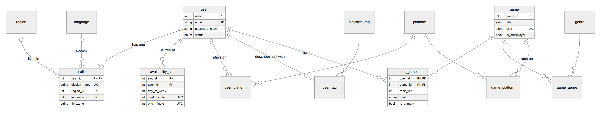
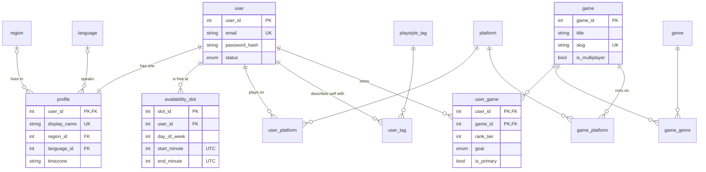
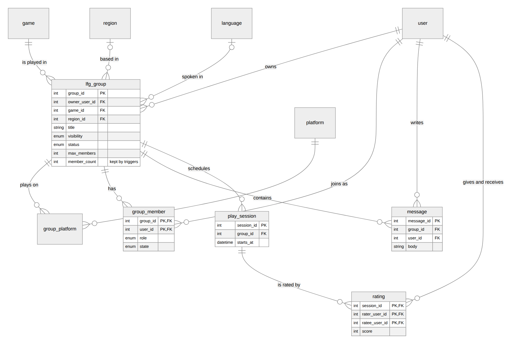
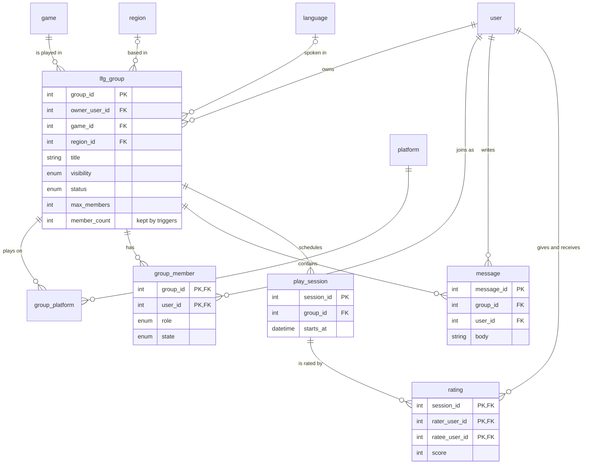

# ER diagram

FAZE has **24 tables**. They are drawn below in two pictures so each one stays
readable, and the remaining housekeeping tables are listed after them. Every
box and line comes from the real database (`information_schema`), and the full
column list for every table is in [`schema.md`](schema.md).

**How to read the lines.** A line is a foreign key. The symbol at each end says
how many rows can sit on that side: `||` exactly one, `o|` zero or one,
`}o` zero or many. So `user ||--o{ lfg_group` reads "one user owns zero or many
groups".

## 1. People, profiles and games

A person has one profile, a weekly availability, and links to the platforms,
play-style tags and games they play. Tables ending in `_platform`, `_tag`,
`_game` or `_genre` are **join tables**: they turn a many-to-many relationship
(a person plays many games, a game is played by many people) into two
one-to-many ones.

## 2. Groups and what happens in them

A group is created for one game and owned by one user. People belong to it
through `group_member`, talk in it through `message`, schedule a `play_session`,
and can rate each other afterwards.

## Tables not drawn

| Table                                                   | What it is for                                                                                        |
| ------------------------------------------------------- | ----------------------------------------------------------------------------------------------------- |
| `region_adjacency`                                      | Which regions border each other (region to region).                                                   |
| `join_request`, `report`                                | Join approvals and user reports. Built, but not part of the demo (see [`SCOPE.md`](SCOPE.md)).        |
| `refresh_token`, `email_verification`, `password_reset` | Sign-in housekeeping; each points to one `user`.                                                      |
| `audit_log`                                             | A record of important changes, written by triggers. It keeps its rows even after the user is deleted. |
| `etl_run`, `etl_reject`                                 | A log of each game-data import and the rows it refused, and why.                                      |
| `stg_*` (4 tables)                                      | Temporary staging tables the import loads into first.                                                 |
| `schema_migrations`                                     | Which database changes have been applied.                                                             |

## Redrawing the pictures

The sources are `img/er-people.mmd` and `img/er-groups.mmd` (Mermaid text). Edit
the text, then paste it into <https://mermaid.live> to export a new PNG. The
Mermaid blocks above also render directly on GitHub.
